# Operation instructions

## Table of contents

- [Introduction](#introduction)
- [Home page](#home-page)
    - [Header](#header)
    - [Filter](#filter)
    - [Categories](#categories)
    - [Applied Filters](#applied-filters)
    - [Services](#services)
- [Service configuration](#service-configuration)
    - [Name and explanation](#name-and-explanation)
    - [Properties](#properties)
    - [Notes](#notes)
    - [Usage configuration](#usage-configuration)
    - [Number of instances](#number-of-instances)
- [Shopping cart flyout](#shopping-cart-flyout)
- [Shopping cart](#shopping-cart)

## Introduction

This document describes how to operate the application. It is intended for the end user of the application.

We go over the main pages of the application and describe the different sections of those pages.

## Home page

We start in the Home page of the application. The Home page is the page that is shown when the webpage is opened.

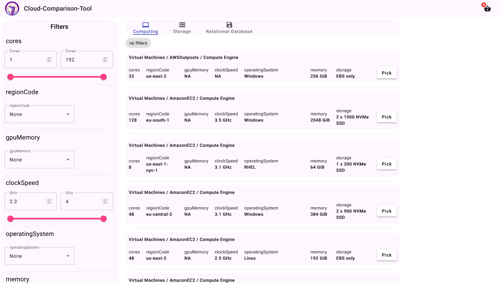

The Home page is split into different sections. Those sections are described in the following.

### Header

The first section is the header. The header contains the logo of the application and the shopping cart icon.

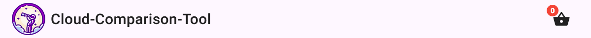

### Filter

The second section is the filter. The filter contains the filter options for the services.

The filter section is located on the left side of the page.

The filters are applied automatically when a filter option is changed. and are displayed in the applied filters
section. [Applied Filters](#applied-filters)

There are two types of filter options:

- **Dropdown**: The dropdown filter options are used to select a single value.
- **Slider**: The slider filter options are used to select a range of values.

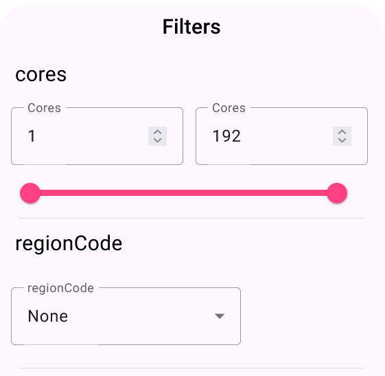

### Categories

The third section is the categories. The categories section contains the categories of the available services.

The categories section is located on the top center of the page.

The categories consist of a name and icon. You can switch between the categories by clicking on the category name or
icon.

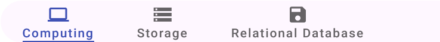

When a category is selected the filter options are updated to the filter options of the selected category.
The services are updated to the services of the selected category.

### Applied Filters

The fourth section is the applied filters. The applied filters section contains the currently applied filters.

The applied filters section is located on the top center of the page below the categories.

The applied filters consist of a name and a remove button.

When a filter is applied it is displayed in the applied filters section.
You can remove a filter by clicking on the remove button.
This removes the filter from the applied filters section and updates the services.

If no filters are applied the applied filters section shows a message that no filters are applied.

### Services

The fifth section is the services. The services section contains the services of the selected category.

The services section is located in the center of the page.

The services are filtered by the applied filters and the category.

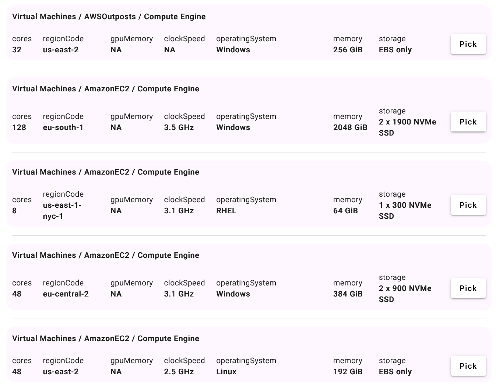

Each service has a name consisting of the names given by the cloud provider (e.g. AWS, GCP, Azure).
Each service shows details about the service. The details are dynamic and can be different for each category.

Each service can be added by clicking on the `Pick` button.

## Service configuration

The service configuration page is used to configure the service that was picked on the home page.

It is a modal that is opened when a service is picked.

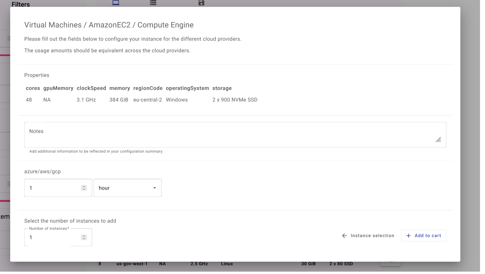

The service configuration page is split into different sections. Those sections are described in the following.

### Name and explanation

The first section is the name and explanation.

The name consists of the name given by the cloud provider (e.g. AWS, GCP, Azure).
The explanation consists of a short text how this configuration dialog should be used.

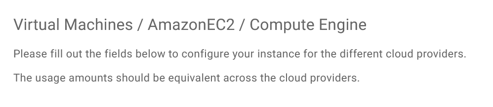

### Properties

The second section is the properties. The properties section contains the properties of the service.

This section is dynamic and can be different for each category.

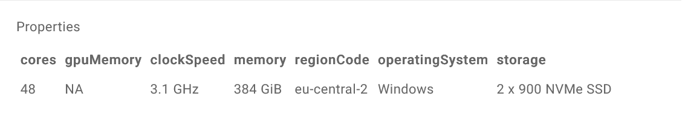

### Notes

The third section is the notes. Notes can be added in the text field and are displayed in
the [shopping cart](#shopping-cart).

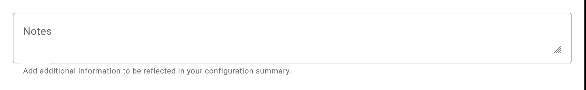

### Usage configuration

The fourth section is the usage configuration. The usage configuration section contains the individual usage
configuration of the service.

This section is dynamic and can be different for each service.

It reflects the billing unit of the service for each cloud provider.

Those can be different for each cloud provider.

In order to get a comparable price we parse the different billing units and see if they are comparable. (e.g. 1 Hour, 1
Month, 1 Year...)

If they are compatible we can collapse those automatically into one and convert those into a common unit.

If they are not compatible we can not collapse those automatically and the user has to select the billing unit manually.
This should be done in a way that they reflect the expected usage for that service.

**Compatible usage configuration:**

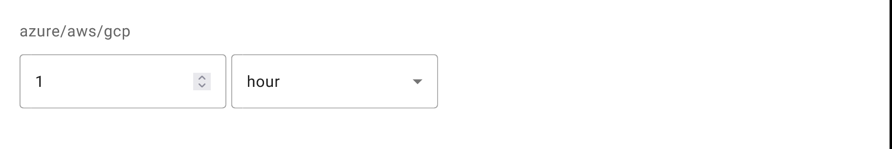

**Incompatible usage configuration:**

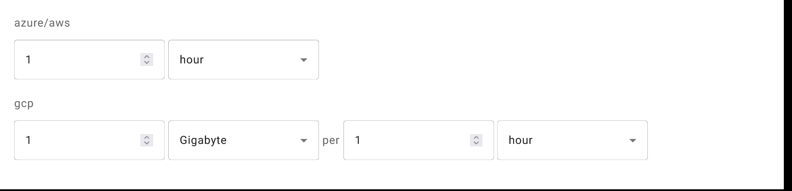

### Number of instances

The fifth section is the number of instances. The number of instances section contains an input field to select the
number of instances, which is used to calculate the price.

We can select the number of instances by clicking on the `▲` and `▼` buttons or by typing the number of instances into
the input field.

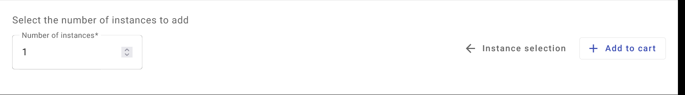

We can add the service to the [shopping cart](#shopping-cart) by clicking on the `Add to cart` button and go back to
the [home page](#home-page) by clicking on the `Instance selection` button.

## Shopping cart flyout

The shopping cart flyout is used to briefly show the services that were added to the shopping cart.

The flyout is opened by clicking on the shopping cart icon in the [header](#header).

It shows added services grouped by category.

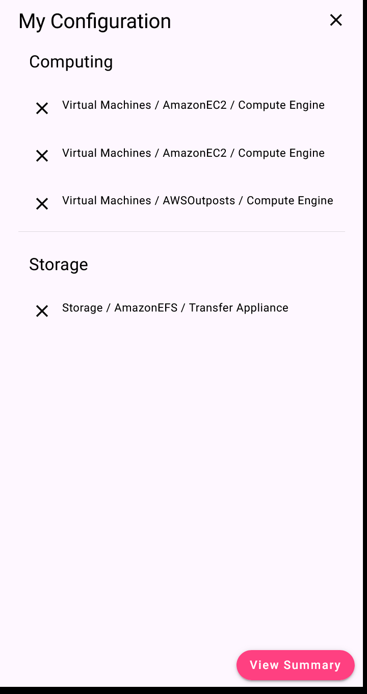

A service can be removed from the shopping cart by clicking on the `X` button on the left side of the service.

A detailed overview ([shopping cart](#shopping-cart)) can be opened by clicking on the `View summary` button on the
bottom of the flyout.

It can be closed by clicking on the `X` button on the top right of the flyout or by clicking outside the flyout.

## Shopping cart

The shopping cart is used to show the services that were added to the shopping cart.

The shopping cart is opened by clicking on the `View summary` button in
the [shopping cart flyout](#shopping-cart-flyout).

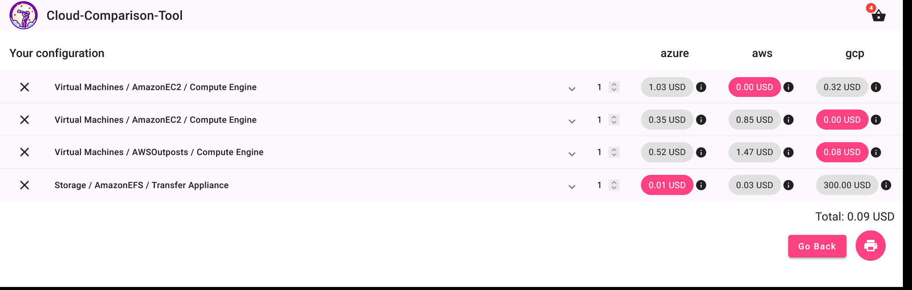

It shows a list of services in the order they were added.

By default, the cheapest price is selected. The cheapest price is highlighted in pink.

The amount of instances can be changed by clicking on the `▲` and `▼` buttons or by typing the number of instances into
the input field.

The instance can be removed from the shopping cart by clicking on the `X` button on the left side of the service.

We can select the instance from a different provider by selecting the price in the table.

Next to the price is a tooltip containing the billing unit of the service.

The total price is calculated and shown on the bottom of the shopping cart.

We can expand the service by clicking on its name.
This shows the details of the service and the notes that were added during
the [service configuration](#service-configuration).
As well as the usage configuration for each provider and the number of instances of that service.

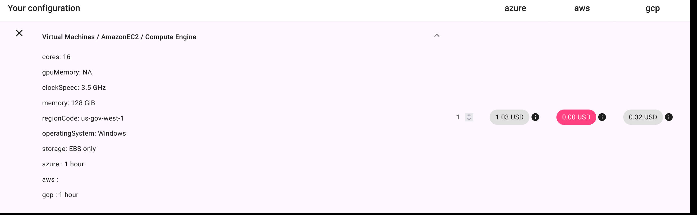

We are able to print the shopping cart by clicking on the `Print`-Icon button on the bottom of the shopping cart.

We can go back to the [home page](#home-page) by clicking on the `Go Back` button on the bottom of the shopping cart.